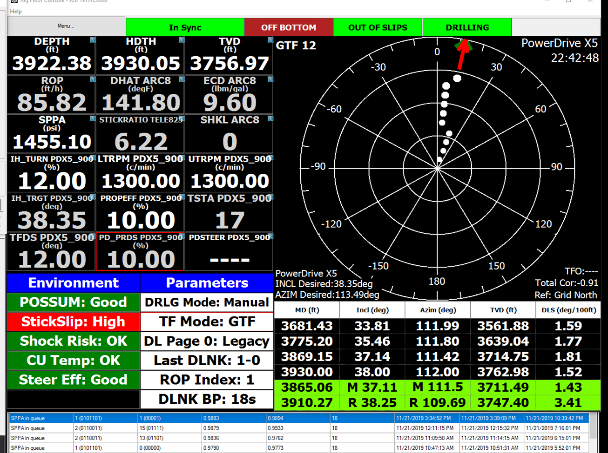

# ReadScreen

**ReadScreen** is a Windows utility that reads real-time directional drilling survey data — **Depth**, **Inclination (INC)**, and **Azimuth (AZI)** — directly from the *Rig Floor Console* application screen using Tesseract OCR, then outputs the parsed values to `output.csv` for live survey calculations.

It comes in two flavours: a **CLI version** (`main-auto.py`) with a rich terminal UI and a **GUI version** (`main-gui.py`) with a modern dark-themed interface.



---

## Features

- **Zero configuration** auto-detection of the Rig Floor Console window (no manual coordinate entry needed)
- Supports **MWD** and **RSS** survey rows simultaneously
- Three OCR preprocessing methods: `replace` (green-on-dark display), `threshold` (Otsu), `original`
- **Motor** and **RSS** tool types with automatic crop ratios
- Configurable scale factor (1–10×) for resizing before OCR
- Outputs to `output.csv` every 2 seconds — plug directly into the companion Excel sheet
- Bundled local Tesseract — **no system-wide install required**
- Ships as a single `.exe` for easy deployment on rig machines

---

## Quick Start (Pre-compiled EXE)

> No Python install required on the target machine.

1. Download and extract the latest release from [Releases](https://github.com/mrkaqz/readscreen/releases)
2. Ensure the folder structure is intact:
   ```
   readscreen/
   ├── main-auto.exe       # CLI version
   ├── main-gui.exe        # GUI version
   ├── tess_config.json    # OCR configuration
   └── tesseract/          # Local Tesseract engine
   ```
3. Run `main-gui.exe` for the GUI, or `main-auto.exe` for the terminal version
4. If the app fails to start, install [Visual C++ Redistributable x64](https://aka.ms/vs/17/release/vc_redist.x64.exe)

---

## Running from Source

### Prerequisites

| Requirement | Version |
|---|---|
| Python | 3.10+ (3.13 tested) |
| Windows | 10 / 11 |

### Installation

```bash
# Clone the repo
git clone https://github.com/mrkaqz/readscreen.git
cd readscreen

# Create and activate virtual environment
python -m venv venv
venv\Scripts\activate

# Install dependencies
pip install -r requirements.txt
```

### Tesseract Setup

Run once to extract a local Tesseract copy into `./tesseract/`:

```bash
# Place tesseract-ocr-w64-setup-v5.0.0-alpha.20201127.exe in the project folder first
python setup_tesseract.py
```

Alternatively, install [Tesseract system-wide](https://github.com/UB-Mannheim/tesseract/wiki) — the scripts will fall back to `C:\Program Files\Tesseract-OCR\tesseract.exe` automatically.

---

## Usage

```bash
# Activate venv first
venv\Scripts\activate

# GUI version (recommended)
python main-gui.py

# CLI version
python main-auto.py

# Debug OCR — tests all 3 preprocessing methods side-by-side
python ocr-debug.py

# Generate tess_config.json by clicking screen coordinates
python create-config.py

# Find the exact window title of the Rig Floor Console
python winname.py
```

---

## Configuration (`tess_config.json`)

```jsonc
{
  "method": "replace",       // "replace" | "threshold" | "original"
  "tesseract_config": "--psm 6 --oem 1",
  "loc_x1": 0,               // Manual window coords (0 = use auto-detect)
  "loc_y1": 0,
  "loc_x2": 0,
  "loc_y2": 0
}
```

| Field | Description |
|---|---|
| `method` | OCR preprocessing method. Use `replace` for green-on-dark displays, `threshold` for high-contrast, `original` for raw |
| `tesseract_config` | Tesseract CLI flags passed to `pytesseract` |
| `loc_x1/y1/x2/y2` | Manual window crop coordinates. Set all to `0` for auto window detection |

To generate coordinates interactively, run `python create-config.py` and click the two corners of the survey data region on screen.

---

## How Auto Window Detection Works

In **auto mode**, the app:
1. Calls `win32gui.GetForegroundWindow()` + `GetWindowText()` once at startup to identify the window titled `"Rig Floor Console -"`
2. Each loop calls `win32gui.FindWindow()` + `GetWindowRect()` to get the current position and size — so it tracks the window even if you move it

No manual coordinate entry is needed; just bring the Rig Floor Console window to the foreground before pressing Start.

---

## Companion Excel Sheet

The companion Excel workbook reads `output.csv` every few seconds and calculates:

- Build Rate & Turn Rate
- Dogleg Severity (DLS)
- Survey propagation

| Version | File |
|---|---|
| Latest (v0.3.8) | `Survey Realtime Track Sheet-Auto V.0.3.8.xlsm` |

> **Macro setup**: Enable macros and click *Start Auto-Update* to begin live refreshing.

---

## Building from Source (Nuitka)

```bash
# Activate venv
venv\Scripts\activate

# Install build tool + compression
pip install nuitka zstandard

# Build GUI version
python -m nuitka --onefile --windows-icon-from-ico=icon.ico --enable-plugin=tk-inter --windows-console-mode=disable --zig --output-filename=main-gui.exe main-gui.py

# Build CLI version
python -m nuitka --onefile --windows-icon-from-ico=icon.ico --zig --output-filename=main-auto.exe main-auto.py
```

Output: single `.exe` (~70–85 MB) in the project root. Copy alongside `tess_config.json` and the `tesseract/` folder before distributing.

---

## Project Structure

```
readscreen/
├── main-auto.py              # CLI version (v1.4) — production
├── main-gui.py               # GUI version — dark-themed tkinter app
├── main.py                   # Legacy CLI (v0.3.1, uses mss + config.json)
├── main-replace.py           # Replace-method only variant
├── main-threshold.py         # Threshold-method only variant
├── ocr-debug.py              # Side-by-side OCR debug (all 3 methods)
├── create-config.py          # Interactive coord capture → config.json
├── winname.py                # Print foreground window title in a loop
├── setup_tesseract.py        # Extract local Tesseract from installer
├── replace-traindata.py      # Copy eng.traineddata to tessdata dir
├── tess_config.json          # Active OCR config (used by main-auto.py)
├── config.json               # Legacy config (used by main.py)
├── icon.ico                  # App icon
├── requirements.txt          # Python dependencies
└── Survey Realtime Track Sheet-Auto V.0.3.8.xlsm  # Companion Excel
```

---

## License

Apache License 2.0 — see [LICENSE](LICENSE) for details.

Copyright (c) 2021 Ronnarong Wongmalasit
